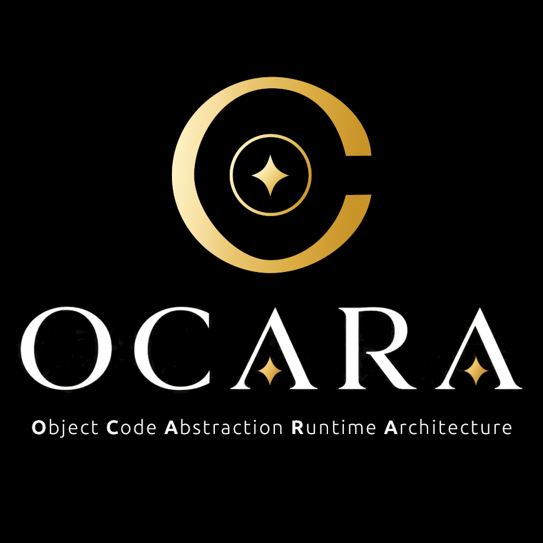

# Ocara

[](https://github.com/yourusername/ocara/releases)
[](LICENSE)
[](https://www.rust-lang.org/)

**O**bject **C**ode **A**bstraction **R**untime **A**rchitecture

Langage de programmation moderne compilé en natif avec typage statique fort et architecture web complète intégrée.  
Serveur HTTP, composants HTML réutilisables avec slots, génération de pages dynamiques — le tout compilé en binaire natif.

> Un langage compilé natif avec composants web intégrés. Performances C++, ergonomie TypeScript, architecture Vue.js — tout dans un binaire zéro-dépendance.



---

## Caractéristiques

- 🛡️ **Typage statique fort** — détection des erreurs à la compilation
- ⚡ **Compilation native** — backend Cranelift pour des performances optimales
- 🧹 **Sans ramasse-miettes (GC)** — par choix de design, jamais ; la libération mémoire est explicite via `scoped`/`consumed` (voir `docs/EBNF.md` §9)
- 🌐 **Architecture web intégrée** — serveur HTTP, composants HTML avec slots, routing natif
- 📦 **Bibliothèque standard riche** — HTTP, JSON, Regex, Threads, et plus
- 🎯 **Orienté objet** — classes, interfaces, héritage, méthodes statiques
- ✅ **Tests intégrés** — ocaraunit pour tests unitaires avec couverture
- 🛠️ **Outillage complet** — linter (ocaracs), test runner, diagnostics

---

## Prérequis

| Outil | Version minimale | Rôle |
|---|---|---|
| Rust / Cargo | 1.75+ | Construire le compilateur |
| `cc` (gcc ou clang) | tout | Éditeur de liens final |

### Installer Rust et Cargo

| Plateforme | Installation |
|---|---|
| Debian / Ubuntu | `sudo apt install cargo` |
| Fedora / RHEL | `sudo dnf install cargo` |
| macOS | `brew install rust` ou `curl --proto '=https' --tlsv1.2 -sSf https://sh.rustup.rs \| sh` |

### Installer l'éditeur de liens `cc`

`cc` est l'éditeur de liens appelé à chaque compilation d'un fichier `.oc`. Il doit être présent sur le système :

| Plateforme | Installation |
|---|---|
| Debian / Ubuntu | `sudo apt install build-essential` |
| Fedora / RHEL | `sudo dnf install gcc` |
| macOS | `xcode-select --install` |

### Dépendances GUI natives (builtin `Tauri`)

Le builtin [Tauri](docs/builtins/Tauri.md) embarque une fenêtre WebView native (GTK/WebKit sur Linux). Ces bibliothèques système sont requises pour que `make build` compile `runtime/`, même sans utiliser Tauri dans votre script :

| Plateforme | Installation |
|---|---|
| Debian / Ubuntu | `sudo apt install libgtk-3-dev libwebkit2gtk-4.1-dev libjavascriptcoregtk-4.1-dev libsoup2.4-dev libayatana-appindicator3-dev librsvg2-dev libxdo-dev libssl-dev patchelf` |
| Fedora / RHEL | `sudo dnf install gtk3-devel webkit2gtk4.1-devel libsoup-devel libappindicator-gtk3-devel librsvg2-devel` |
| macOS | Aucune — WebKit est fourni par le système (`xcode-select --install` suffit) |
| Windows | [WebView2](https://developer.microsoft.com/microsoft-edge/webview2/) (préinstallé avec Edge sur Windows 10/11 récents) |

> **Ubuntu ≥ 24.04 :** les paquets `libwebkit2gtk-4.0-dev` / `libjavascriptcoregtk-4.0-dev` n'existent plus dans les dépôts (remplacés par la 4.1, ABI compatible). Installez les paquets `4.1` ci-dessus — le `Makefile` génère automatiquement un alias pkg-config local (`.pkgconfig-shim/`, jamais dans `/usr/lib`) au moment de `make build`/`make build-dev`. Aucune action manuelle supplémentaire n'est nécessaire.

### Dépendances GUI natives (builtin `SDL`)

Le builtin [SDL](docs/builtins/SDL.md) compile SDL3 **depuis les sources** et le lie statiquement (`sdl3-sys`, feature `build-from-source-static`) — aucun `libSDL3.so` n'est requis sur la machine qui **exécute** un binaire compilé avec Ocara. En revanche, compiler `runtime_sdl/` (donc `make build`/`make build-dev`, même sans utiliser SDL dans votre script) nécessite un compilateur C, **CMake**, et les headers de dev du serveur d'affichage :

| Plateforme | Installation |
|---|---|
| Debian / Ubuntu | `sudo apt install cmake libx11-dev libxext-dev libxrandr-dev libxcursor-dev libxi-dev libxss-dev libpng-dev zlib1g-dev` |
| Fedora / RHEL | `sudo dnf install cmake libX11-devel libXext-devel libXrandr-devel libXcursor-devel libXi-devel libXScrnSaver-devel libpng-devel zlib-devel` |
| macOS | `brew install cmake libpng` (les frameworks Cocoa/Metal nécessaires sont fournis par le système) |

> Wayland (optionnel, en plus de X11 ci-dessus) : `libwayland-dev libxkbcommon-dev libdecor-0-dev` sur Debian/Ubuntu.

> `libpng-dev`/`zlib1g-dev` : requis pour le chargement d'images PNG (Palier 2,
> `SDL::loadTexture`) — le décodage JPEG et le rendu de texte (SDL_ttf,
> FreeType/HarfBuzz) sont vendored automatiquement, aucune lib système
> supplémentaire nécessaire pour eux.

> **Audio (Palier 3, `SDL::loadSound`/`playMusic`) sur un desktop Linux
> moderne :** sans `libpulse-dev` (et/ou `libpipewire-0.3-dev`) installé au
> moment de `make build`, SDL3 ne compile que le driver **ALSA** — qui exige
> un accès direct à `/dev/snd`, généralement réservé au groupe Unix `audio`.
> Sur une machine où le son passe par PipeWire/PulseAudio (le cas courant —
> Ubuntu, GNOME, KDE récents), sans ces `-dev`, `loadSound`/`playMusic`
> échoueront avec `SDLException` même si le son fonctionne très bien pour vos
> autres applications. Installez `sudo apt install libpulse-dev` (Debian/
> Ubuntu) avant `make build` pour que SDL détecte et utilise automatiquement
> la session PipeWire/PulseAudio déjà active, comme n'importe quelle autre
> application desktop.

---

## Démarrage rapide

```bash
# 1. Compiler Ocara
make build

# 2. Créer un fichier hello.oc
cat > hello.oc << 'EOF'
import ocara.IO

function main(): int {
    IO::writeln("Bonjour depuis Ocara !")
    return 0
}
EOF

# 3. Compiler et exécuter
./target/release/ocara hello.oc -o hello
./hello
# Bonjour depuis Ocara !
```

---

## Utilisation du compilateur

### Syntaxe

```bash
ocara [options] <fichier.oc>
```

### Options

| Option | Description |
|---|---|
| `-o <fichier>` | Nom du binaire de sortie |
| `--check` | Validation sémantique uniquement (pas de génération de code) |
| `--dump` | Afficher la représentation intermédiaire (IR) |
| `--no-link` | Compiler sans lier (génère un `.o`) |
| `--release` | Optimisations maximales (défaut : debug) |
| `--src <dossier>` | Dossier racine pour la résolution des imports |

### Exemples

```bash
# Compilation simple
ocara main.oc -o main

# Validation sans compilation
ocara main.oc --check

# Afficher l'IR généré
ocara main.oc --dump

# Compilation optimisée
ocara main.oc -o main --release

# Résoudre les imports depuis un dossier spécifique
ocara tests/MyTest.oc --src . -o test
```

### Résolution des imports

Par défaut, ocara résout les imports relativement au dossier du fichier compilé. 

Utilisez `--src` pour spécifier un dossier racine :

```bash
# Structure :
# project/
#   ├── lib/
#   │   └── Math.oc
#   └── tests/
#       └── MathTest.oc   # import lib.Math

# Sans --src : échec (cherche lib/ dans tests/)
ocara tests/MathTest.oc -o test

# Avec --src : succès (cherche lib/ depuis project/)
ocara --src . tests/MathTest.oc -o test
```

---

## Commandes Makefile

### Compilation

| Commande | Description |
|---|---|
| `make build` | Compile ocara (release, strict) |
| `make build-dev` | Compile ocara (debug, strict) |
| `make build-tools` | Compile les outils (release, strict) |
| `make build-tools-dev` | Compile les outils (debug, strict) |
| `make build-all` | Compile tout (release) |
| `make build-all-dev` | Compile tout (debug) |

### Tests

| Commande | Description |
|---|---|
| `make tests` | Lance les tests unitaires Cargo |
| `make regression` | Teste tous les exemples |
| `make tests-examples` | Lance ocaraunit sur les exemples |
| `make lint-examples` | Lance ocaracs sur les exemples |

### Installation

| Commande | Description |
|---|---|
| `make install` | Installe ocara dans `/usr/local/bin/` |
| `make install-tools` | Installe les outils dans `/usr/local/bin/` |
| `make install-all` | Installe tout (ocara + outils) |

### Désinstallation

| Commande | Description |
|---|---|
| `make uninstall` | Désinstalle ocara |
| `make uninstall-tools` | Désinstalle les outils |
| `make uninstall-all` | Désinstalle tout |

### Nettoyage

| Commande | Description |
|---|---|
| `make clean` | Supprime les artefacts d'ocara |
| `make clean-tools` | Supprime les artefacts des outils |
| `make clean-all` | Supprime tous les artefacts |

---

## Structure du projet

```
Ocara/
├── src/               ← Code source du compilateur (Rust)
├── runtime/           ← Runtime C pour les builtins
├── examples/          ← Exemples de code Ocara (.oc)
├── docs/              ← Documentation complète
└── tools/             ← Outils (ocaraunit, ocaracs)
```

---

## Documentations

| Document | Description |
|---|---|
| [docs/README.md](docs/README.md) | **Index complet de la documentation** — guides, builtins, outils |
| [examples/README.md](examples/README.md) | Index des exemples de code Ocara |
| [tools/ocaraunit/README.md](tools/ocaraunit/README.md) | Runner de tests unitaires avec couverture |
| [tools/ocaracs/README.md](tools/ocaracs/README.md) | Analyseur de style et linter |

---

## Licence

Ocara est distribué sous licence MIT. Voir le fichier [LICENSE](LICENSE) pour plus de détails.

Copyright © 2026 David Lhoumaud

